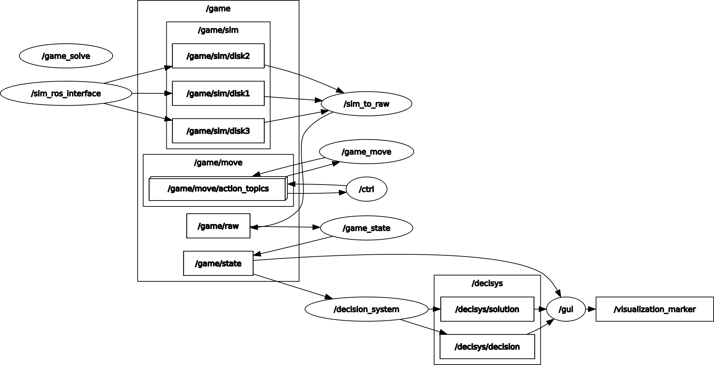
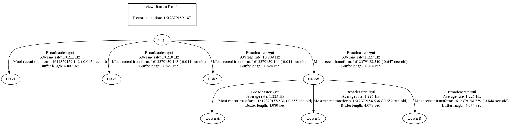

A "healthy" system:

`$ rosrun rqt_graph rqt_graph`



`$ rosrun tf view_frames`



`$ rostopic list`
```
/clicked_point
/decisys/decision
/decisys/solution
/game/move/cancel
/game/move/feedback
/game/move/goal
/game/move/result
/game/move/status
/game/raw
/game/sim/disk1
/game/sim/disk2
/game/sim/disk3
/game/state
/initialpose
/move_base_simple/goal
/rosout
/rosout_agg
/tf
/tf_static
/visualization_marker
/visualization_marker_array
```

`$ rosservice list`
```
/ctrl/get_loggers
/ctrl/set_logger_level
/decision_system/get_loggers
/decision_system/set_logger_level
/game/solve
/game/solve/possible
/game/solve/valid
/game_move/get_loggers
/game_move/set_logger_level
/game_solve/get_loggers
/game_solve/set_logger_level
/game_state/get_loggers
/game_state/set_logger_level
/gui/get_loggers
/gui/set_logger_level
/rosout/get_loggers
/rosout/set_logger_level
/rviz_[..]/get_loggers
/rviz_[..]/load_config
/rviz_[..]/reload_shaders
/rviz_[..]/save_config
/rviz_[..]/set_logger_level
/sim_ros_interface/get_loggers
/sim_ros_interface/set_logger_level
/sim_to_raw/get_loggers
/sim_to_raw/set_logger_level
```
