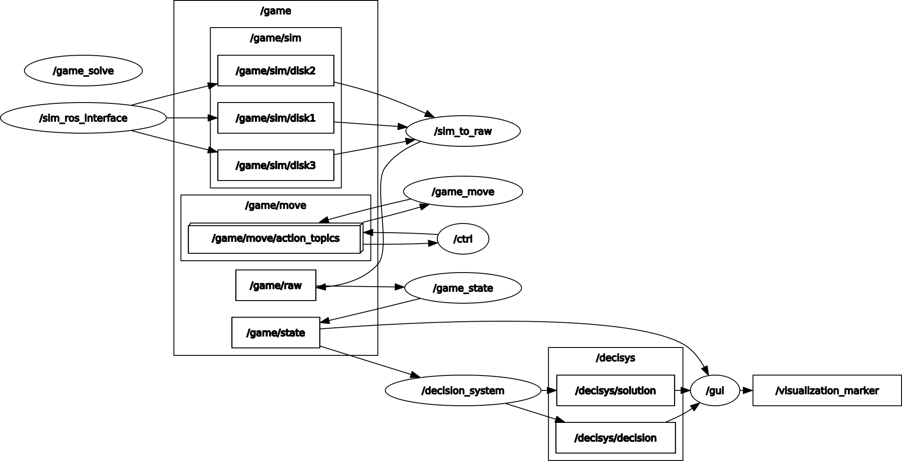

A "healthy" system:

`$ rosrun rqt_graph rqt_graph`



`$ rostopic list`
```
/clicked_point
/decisys/decision
/decisys/solution
/game/move/cancel
/game/move/feedback
/game/move/goal
/game/move/result
/game/move/status
/game/raw
/game/sim/disk1
/game/sim/disk2
/game/sim/disk3
/game/state
/initialpose
/move_base_simple/goal
/rosout
/rosout_agg
/tf
/tf_static
/visualization_marker
/visualization_marker_array
```

`$ rosservice list`
```
/game/solve
/game/solve/possible
/game/solve/valid
/ctrl,decision_system,game_solve,game_state,gui,rosout,rviz_[..],sim_ros_interface,sim_to_raw/get_loggers
/ctrl,decision_system,game_solve,game_state,gui,rosout,rviz_[..],sim_ros_interface,sim_to_raw/set_logger_level
```
