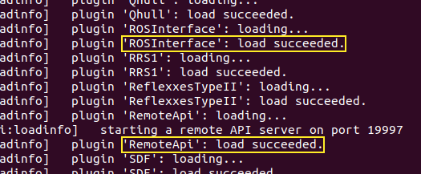
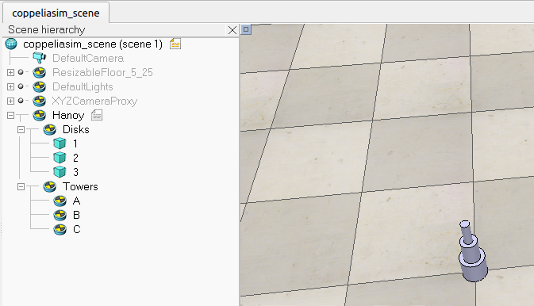
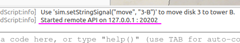
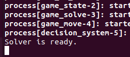
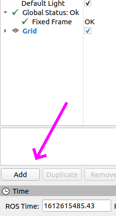
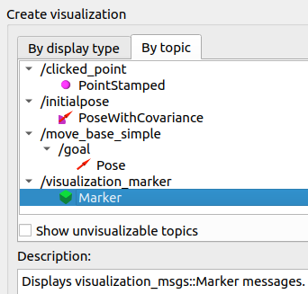
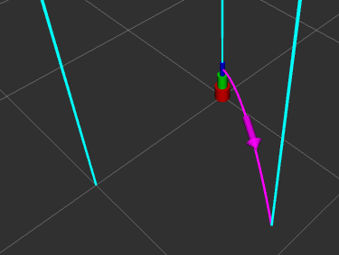
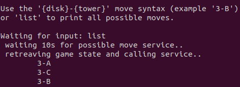

Recommendation: add the following alias and use it from every new terminal.
> `alias cm="cd ~/catkin_ws ; catkin_make ; source devel/setup.bash`

Make sure to start a ROS master.
> `$ roscore`

Start CoppeliaSim from a terminal.
> `$ coppeliaSim.sh`

Look through the logs for `plugin 'ROSInterface': load succeeded.` and `plugin 'RemoteApi': load succeeded.`.

Open the scene [coppeliasim_scene.ttt](../sim/coppeliasim_scene.ttt). The scene hierarchy display show the following:

(The child script attached to the Hanoy object is [this non-threaded LUA](../sim/nonthreaded_childscript_hanoy.lua).)

Start the simulation (it is recommended to use the Newton engine and have real-time simulations on).

The integrated output should state that the remote API is started:

When that is the case, the nodes from the `hanoying_back` package can be started.
> `$ roslaunch hanoying_back back.launch`

Start the GUI using the following line in a dedicated terminal:
> `$ rosrun hanoying_front gui.py`

This node should start a R-Viz window. Once it is fully started, look for the Add button in the bottom left.

In the dialog that open, switch to the tab "By topic" and choose "Markers".

The graphical view should now show the 3 towers (cyan beams), the 3 disks (red, green and blue cylinders) and the decision from the decision_system (`/decisys/decision`) in magenta.

From a new terminal, start a simplified control node.
> `$ rosrun hanoying_front ctrl.py`

